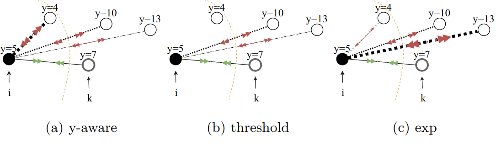

# Contrastive learning for regression in multi-site brain age prediction

Carlo Alberto Barbano<sup>1,2</sup>, Benoit Dufumier<sup>1,3</sup>, Edouard Duchesnay<sup>3</sup>, Marco Grangetto<sup>2</sup>, Pietro Gori<sup>1</sup> | [[pdf](https://arxiv.org/pdf/2211.08326.pdf)] [[poster](https://drive.google.com/file/d/1gr45EamhVVClPbMT5T5b1Gy9V50fgw3c/view)]

1<sub>LTCI, Télécom Paris, IP Paris</sub><br>
2<sub>University of Turin, Computer Science dept.</sub><br>
3<sub>NeuroSpin, CEA, Universite Paris-Saclay</sub>
<br/><br/>



Building accurate Deep Learning (DL) models for brain age prediction is a very relevant topic in neuroimaging, as it could help better understand neurodegenerative disorders and find new biomarkers. To estimate accurate and generalizable models, large datasets have been collected, which are often multi-site and multi-scanner. This large heterogeneity negatively affects the generalization performance of DL models since they are prone to overfit site-related noise. Recently, contrastive learning approaches have been shown to be more robust against noise in data or labels. For this reason, we propose a novel contrastive learning regression loss for robust brain age prediction using MRI scans. Our method achieves state-of-the-art performance on the OpenBHB challenge, yielding the best generalization capability and robustness to site-related noise.


## Running 

### Training

The code can be found in the src folder. For training there is a couple of different files: 

- `main_mse.py`: for training baseline MSE/MAE models
- `main_infonce.py`: for training models with contrastive losses 

For easiness of use, the script `launcher.py` is provided with some predefined experiments which can be found in `src/exp` as YAML template. To launch: 

```
python3 launcher.py exp/mae.yaml
```

### Testing on the leaderboard

To test on the official leaderboard of the OpenBHB challenge, first you need to create an account at [https://ramp.studio/](https://ramp.studio/). For the submission to the challenge ([https://ramp.studio/events/brain_age_with_site_removal_open_2022](https://ramp.studio/events/brain_age_with_site_removal_open_2022)), the source code for submission can be found in the `ramp-submission` folder (code for both supervised and contrastive models).

## Citing

For citing our work, please use the following bibtex entry:

```bibtex
@inproceedings{barbano2023contrastive,
    author = {Barbano, Carlo Alberto and Dufumier, Benoit and Duchesnay, Edouard and Grangetto, Marco and Gori, Pietro},
    journal = {International Symposium on Biomedical Imaging (ISBI)},
    title = {Contrastive learning for regression in multi-site brain age prediction},
    year = {2023}
}
```